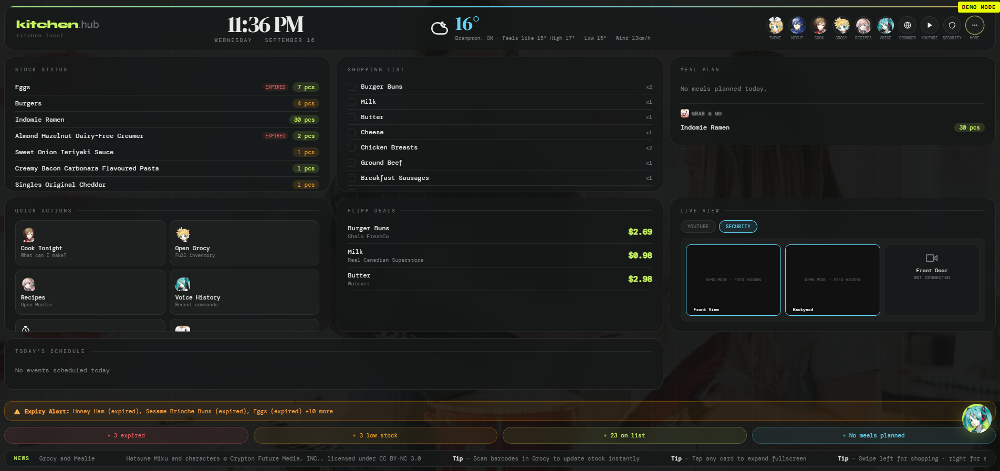

# Kitchen Hub

A self-hosted kitchen dashboard running on a Raspberry Pi 5, mounted on the fridge behind a touchscreen. It tracks pantry inventory, plans meals, watches for expiring food, listens for voice commands, and quietly sleeps when nobody's around to save power and heat.

Everything runs locally — no cloud dependency for the core features, no subscription, no third party holding the data.



## What it does

- **Inventory tracking** via [Grocy](https://grocy.info/) — stock levels, expiry alerts, shopping list, all synced to a touch-friendly summary view
- **Recipes** via [Mealie](https://mealie.io/) — "what can I cook tonight?" checks your actual stock against saved recipes
- **Emergency Food** — a dedicated view for already-prepared, grab-and-go items (the kind of thing you eat when you're too tired to cook), tagged directly in Grocy
- **Voice commands** — a local [faster-whisper](https://github.com/SYSTRAN/faster-whisper) transcription server turns spoken commands like *"I used two eggs"* or *"add milk to the shopping list"* into real Grocy API calls, entirely on-device, no cloud speech API
- **Voice-driven YouTube search** — *"play lofi hip hop on youtube"* finds and embeds the top result inline
- **Live security camera feeds** — real-time video from WiFi cameras around the house, routed through Home Assistant and proxied server-side so no credentials ever touch the browser
- **Physical label printing** — a Bluetooth LE label printer (Niimbot B1-Pro) wired up as its own Flask service; print a Grocy-linked product label (name + soonest expiry, pulled live from stock) or a free-form text label, straight from the dashboard, with a live WYSIWYG preview, auto-sized text that fills the sticker instead of a fixed small font, a live progress bar, one-tap "purchased/opened today" date presets, and a built-in on-screen keyboard (the kiosk has no physical one)
- **Live weather, calendar, and local flyer deals** (via a small Flask proxy service)
- **Cooking timers** — multiple concurrent timers, persisted across reloads, alert on completion even while the screen is asleep
- **Sleep mode** — the screen goes dark on inactivity, high CPU temperature, or a manual tap, dropping CPU load and heat when nobody's in the kitchen
- **Draggable UI elements** — the floating voice and timer buttons can be repositioned anywhere on screen, with position persisted locally
- **Self-updating kiosk** — the dashboard polls its own `Last-Modified` header and reloads itself the moment a new version is deployed, so a wall-mounted screen with no keyboard or mouse never needs to be manually refreshed (or power-cycled) to pick up a change

## Architecture

```
┌─────────────────────────────────────────────────────────────┐
│                      Raspberry Pi 5                          │
│                                                                │
│  Chromium (kiosk mode, Wayland/labwc) ── touchscreen display  │
│         │                                                      │
│         ▼                                                      │
│  nginx (reverse proxy + TLS) ──┬── /            → Grocy       │
│                                  ├── /dashboard/  → dashboard   │
│                                  ├── /mealie/     → Mealie      │
│                                  ├── /whisper/    → whisper svc │
│                                  ├── /calendar/   → calendar svc│
│                                  └── /label/      → label svc   │
│                                                                │
│  Docker Compose:  grocy · mealie · whisper (faster-whisper)   │
│                    home-assistant                              │
│  Host systemd:     dashboard (static file server)              │
│                     calendar_server.py (Flask: Calendar+Flipp) │
│                     label_server.py (Flask → NiimPrintX → BLE) │
└─────────────────────────────────────────────────────────────┘
```

The dashboard itself is a single self-contained `dashboard.html` — no build step, no framework, no bundler. Everything (styles, logic, and even the character icons, base64-embedded) lives in one file that a plain Python `http.server` serves directly. It talks to Grocy, Mealie, and the voice/calendar services entirely client-side.

## Stack

| Layer | Tech |
|---|---|
| Dashboard | Vanilla HTML/CSS/JS, single file, no build tooling |
| Inventory | [Grocy](https://grocy.info/) |
| Recipes | [Mealie](https://mealie.io/) |
| Voice transcription | [faster-whisper](https://github.com/SYSTRAN/faster-whisper) (local, CPU) |
| Calendar + deals proxy | Flask |
| Label printing | Flask + [NiimPrintX](https://github.com/labbots/NiimPrintX) (patched) over Bluetooth LE |
| Reverse proxy / TLS | nginx |
| Orchestration | Docker Compose (services) + systemd (host processes) |
| Kiosk | Chromium in kiosk mode on native Wayland (`labwc`) |
| Smart home | Home Assistant |

## Some of the harder problems this solved

A few things that came up building this that might be useful if you're doing something similar:

- **CSS Grid auto-placement gaps**: a `grid-column: span 2` card that doesn't fit the remaining columns of its row gets pushed to the next row entirely by the browser, leaving a real empty cell behind — not a bug, just how auto-placement works. Fixed by reordering DOM elements to exploit the gap deliberately rather than fighting the grid.
- **`object-fit: cover` + `object-position` pan limits**: once `cover` has fit an image, one axis always has zero slack to pan along — `object-position` alone can't move it. Real pan/zoom needs a pixel-computed `translate()` applied *after* `scale()` in the transform chain.
- **Drag vs. tap disambiguation**: distinguishing a drag gesture from a tap on the same element is straightforward; suppressing the resulting spurious `click` event afterward is not. A capture-phase listener has to live on an *ancestor* element to reliably fire before the target's own `onclick` — same-element listeners fire in registration order regardless of the capture flag.
- **Chromium kiosk reliability on Raspberry Pi OS**: a Debian workaround flag (`--js-flags=--no-decommit-pooled-pages`, injected automatically by `rpi-chromium-mods` for ARM low-memory devices) silently stopped being recognized after a Chromium point release — the browser process stayed alive and DevTools reported the correct URL, but no page ever actually rendered. The fix is passing an empty `--js-flags=` to override it, but diagnosing "the browser is running but nothing is happening" took directly inspecting the live process tree for renderer/GPU child processes rather than trusting any single status signal.
- **DHCP/IP drift**: never hardcode a LAN IP for inter-service routing — a router reboot silently breaks everything downstream. Docker services route to each other by service name; host-level services route via `host.docker.internal`.
- **Authenticated video in a plain `` tag**: live security camera feeds come from Home Assistant's camera proxy, which requires a bearer token — but a plain `` can't attach custom headers. Rather than exposing the token client-side (a real risk once the dashboard's source is public), nginx injects the `Authorization` header server-side on a dedicated proxy route per camera. The browser only ever requests a same-origin URL; it never sees the credential that makes the request work.
- **A "failed" print that had actually already printed**: after speeding up label printing (see above), a job would occasionally report failure even though the physical label came out fine. The BLE device-discovery scan was the slow part (up to 30s), fixed by caching the printer's BLE address and using bleak's `find_device_by_address()`, which returns as soon as it sees one matching advertisement instead of scanning a whole fixed window. But that exposed a second bug: the *finalization* handshake after all row data is sent (a status-check loop with no iteration cap) would occasionally time out over BLE and raise, even though the label had already physically printed — the print and the bookkeeping that confirms it are two different things. Fixed by bounding those loops and treating that handshake as best-effort: once every row is on the printer, the label exists, and it's misleading to report "failed" over confirmation bookkeeping. Cut a ~60s print to ~15-30s (dominated by the ~65ms-per-row Bluetooth LE write floor) and removed the false negatives — verified with photos and elapsed-time logging on real hardware side by side.
- **The same false-negative bug, twice more, after a Pi reboot**: a fresh reboot exposed that BlueZ's D-Bus service can take a moment to fully settle — the *first* `connect()` after boot would time out even though the printer was found fine (fixed with a bounded retry-with-backoff around connect, clearing the cached address between attempts in case that was stale rather than boot timing). Then the exact same flakiness showed up one step later, in `disconnect()` — after the label had *already* printed successfully. The general lesson: any BLE call after the actual print data is on the printer is bookkeeping, not printing, and none of it should be allowed to flip a successful job to "failed." Disconnect now happens in a `finally` block with its own failure fully swallowed.
- **Reusing a live BLE connection across prints**: even with a fast address-cached scan, every print still paid a few seconds of connect overhead. The printer stays connected (and awake) for as long as a central holds the session open, so the label service now keeps one `PrinterClient` alive across requests instead of reconnecting every time — printing several labels back to back only pays the connect cost once. That meant moving off "one thread + one throwaway event loop per print job" to a single persistent background event loop shared by all requests (jobs are handed to it via `asyncio.run_coroutine_threadsafe`), with an `asyncio.Lock` serializing access to the one physical printer and an automatic one-shot reconnect-and-retry if a cached connection turns out to have gone stale between prints.
- **Reverse-engineering a label printer with no official SDK**: the Niimbot B1-Pro has no public protocol docs, only a community-maintained reference (niimbluelib). Prints reported "completed" but came out physically blank — turned out to be two separate payload-format bugs in the third-party Python library this project builds on: `PrintStart` needs a model-specific 7-byte payload, and `SetPageSize` a 6-byte one, both undocumented outside the JS reference implementation. The final, sneakiest bug was in Bluetooth device discovery itself — the library's device-matching filter assumed the printer's BLE advertisement would carry zero service UUIDs, which was false for this unit's actual advertisement, so it silently rejected the one device it was scanning for. A raw BLE scan (bypassing the library entirely) was what exposed that the printer had been discoverable the whole time.

## Setup

This isn't a one-click deploy — it's tuned to specific hardware (a Raspberry Pi 5, a particular touchscreen, a Wayland kiosk session) and personal accounts (Grocy, Mealie, Google Calendar). Treat it as a reference, not a template.

1. Copy `.env.example` to `.env` and fill in your own Grocy/Mealie/YouTube credentials.
2. `docker compose up -d` to bring up Grocy, Mealie, whisper, nginx, and Home Assistant.
3. Serve `dashboard.html` with any static file server on the host (a one-line `python -m http.server` works fine).
4. Point nginx at your own TLS cert (a self-signed one is fine for a LAN-only setup) and hostname.
5. For voice commands to work, `EMERGENCY_FOOD_GROUP_ID` and the Grocy API key in `dashboard.html` need to match your own Grocy instance.
6. Launch Chromium in kiosk mode pointed at your nginx host — see the comments in `dashboard.html` and the architecture diagram above for how the pieces fit together.
7. Label printing (optional) needs a Niimbot BLE printer, [NiimPrintX](https://github.com/labbots/NiimPrintX) cloned locally, and `label_server.py`'s own Grocy API key filled in. NiimPrintX's upstream `bluetooth.py` and `printer.py` needed several fixes for this printer model — see the reverse-engineering note above — so expect to patch a fresh clone rather than using it as-is.

## License

Personal project, shared for reference. The character art used for some of the UI icons is fan-used under each source's own terms (see comments in `dashboard.html`) and isn't covered by any license on this repo.
